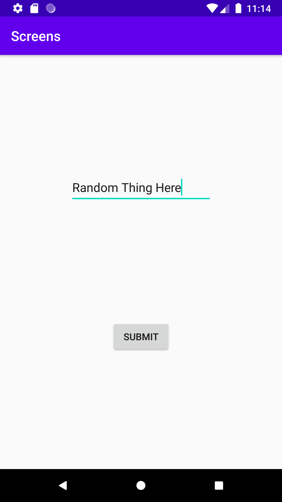
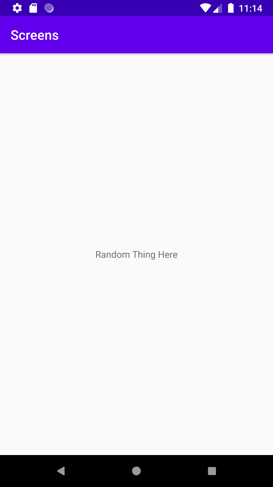

# Rapport

**Skriv din rapport här!**

Jag började med att göra en button view och en edit text view. Efter när dessa två views la tills så
börjades det med att hämta dessa två views i main activity. Började med att göra en button variabel
heter submitButton och som hämtar id för view knappen. 

```
Button submitButton = findViewById(R.id.button);
```

Efter det gjordes det en setOnClickListener funktion med hjälp av variabeln submitButton. Inne i
funktionen laddes det först in en varaibel som heter nameEditText som hittar id från activity_main 
som har en editview som då har id namnet nameEditTextView. Efter det laddes det till intent samt ändrades
det från "SecondActivity" till "SubmitActivity". Samt ändrades value till variabeln nameEditText.
Men detta fungerade inte först utan man behövde först lägga till efter variabel namnet ".getText()"
för att det skulle fungera. Koden under är funktionen setOnClickListener.

```
submitButton.setOnClickListener(new View.OnClickListener() {
    @Override
    public void onClick(View view) {

        EditText nameEditView = findViewById(R.id.nameEditTextView);

        Intent intent = new Intent(MainActivity.this, SubmitActivity.class);
        intent.putExtra("name", nameEditView.getText().toString());
        startActivity(intent);
    }
});
```

När detta gjordes börjades det med den andra screen. Det först laddes till en textview som är texten "TextView".
Därefter gjordes det en variabel som hämtar id från texview och varaibeln heter submitText. Under
det gjordes det en bundle som då hämtar data från main activity som skickar ut data med intent. 
Det gjordes en if sats som då kollar om extra inte är null och extra är variabel som har data typen bundle.
Inne i if satsen finns det en variabel som har datatypen string och som hämtar nyckeln från intent med hjälp
av variabeln extra. Därefter så används det submitText variabel som ska då hämta värdet från intenten som skickas 
och skriva det på textView. Men detta först fungerade inte för att värdet som skickas från main activity skickade inte en
string och då fick man inte något på skärmen. Men när ".toString()" laddes till efter ".getText()" 
så fungerade det att skicka text och man kan se det som man skickade på den andra screen.

```
TextView submitText = findViewById(R.id.submitText);

Bundle extras = getIntent().getExtras();
if (extras != null) {
    String name = extras.getString("name");

    submitText.setText(name);
}
```




